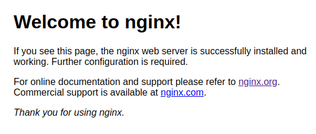
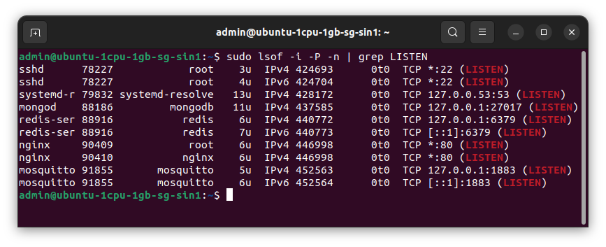

# Prepare server

After provisioning new server on Upcloud, we can connect to it and start configuring our new Linux environment.

## Log into the server

To connect to your Cloud Server, run the following command in your terminal:

```shell
ssh root@95.111.200.178
```

On the first time connecting to the server, you might see the following message. Double-check the IP address is correct, 95.111.200.178 for this server. If the IP address matches, you are safe to continue by answering "yes".

```
The authenticity of host '95.111.200.178 (95.111.200.178)' can't be established.
ECDSA key fingerprint is SHA256:e5b7EB06IiR3BcLaBUm2fhDpptU5VXX3xf4h8cv56xI.
Are you sure you want to continue connecting (yes/no/[fingerprint])?
```

If this is the first time you log into this server, you will be prompted to change the password.

## Add non-root user

You need to add a new user named `admin`. This user will be used for every purposes.

```shell
sudo useradd -m -s /usr/bin/bash admin
```

You need to set a new password for user `admin`. Otherwise you cannot login with that user.

```shell
sudo passwd admin
```

You need to add user `admin` to group `sudo`.

```shell
sudo adduser admin sudo
```

Now you can close current SSH session, open another and login with your newly created credential.

```shell
exit
ssh admin@95.111.202.121
```

## Run update & disable auto update

Before install anything, update our server to latest packages:

```shell
sudo apt update
sudo apt upgrade -y
```

Then disable annoying auto update:

```shell
sudo apt remove unattended-upgrades
```

## Install prerequisites

Then process to install below components.

### Install Git

Check if git is installed, then install if it's not there (barely).

```shell
git --version
```

You should use latest version of git. If git version is around 2.2x, you should remove it:

```shell
sudo apt purge git -y
```

Install git by run these commands line by line, hit `enter` if prompted:

```shell
sudo add-apt-repository ppa:git-core/ppa
sudo apt update
sudo apt install git
```

You should add some configs for git:

```shell
git config --global user.name "yourusername"
git config --global user.email "youremail@gmail.com"
git config --global init.defaultBranch 'main'
git config --global credential.helper store
git config --global alias.loga 'log --oneline --graph --all'
```

### Install npm

Install npm by run this command:

```shell
curl -o- https://raw.githubusercontent.com/nvm-sh/nvm/v0.39.1/install.sh | bash
```

Close current SSH session, then open again.

```shell
exit
ssh admin@95.111.202.121
```

Check if `nvm` is installed properly by checking it's version:

```shell
nvm –version
```

It should output the version number (`0.39.1`) decating `nvm` will be working now.

### Install Node.js

Now you can use `nvm` to install Node.js:

```shell
nvm install --lts
```

Check if Node.js installed properly:

```shell
node –version
```

If it output the version number (e.g. `v16.16.0`), it means Node.js is installed successfully.

You should update `npm` to latest version:

```shell
npm install -g npm@latest
```

### Install pm2

`pm2` is a process manager for Node.js. You will use it to manage your microservices.

Install `pm2`:

```shell
npm install -g pm2
```

### Install MongoDB

See latest guide on how to install MongoDB [here](https://www.mongodb.com/docs/manual/tutorial/install-mongodb-on-ubuntu/) or follow steps below.

Add mongodb key:

```shell
wget -qO - https://www.mongodb.org/static/pgp/server-5.0.asc | sudo apt-key add -
```

Add mongodb list file:

```shell
echo "deb [ arch=amd64,arm64 ] https://repo.mongodb.org/apt/ubuntu focal/mongodb-org/5.0 multiverse" | sudo tee /etc/apt/sources.list.d/mongodb-org-5.0.list
```

Install mongodb:

```shell
sudo apt update
sudo apt upgrade

sudo apt-get install -y mongodb-org
```

Start mongodb:

```shell
sudo systemctl start mongod
```

Check if mongodb has run (hit `q` to exit):

```shell
sudo systemctl status mongod
```

Enable auto start for mongodb (every time server reboot).

```shell
sudo systemctl enable mongod.
```

Test mongodb by using mongo shell:

```shell
mongosh
```

Type `exit` and hit `enter` to exit `mongosh`.

### Install Redis

See latest guide on how to install Redis [here](https://redis.io/docs/getting-started/installation/install-redis-on-linux) or follow steps below.

Add Redis key:

```shell
curl -fsSL https://packages.redis.io/gpg | sudo gpg --dearmor -o /usr/share/keyrings/redis-archive-keyring.gpg
```

Add redis list file:

```shell
echo "deb [signed-by=/usr/share/keyrings/redis-archive-keyring.gpg] https://packages.redis.io/deb $(lsb_release -cs) main" | sudo tee /etc/apt/sources.list.d/redis.list
```

Install redis:

```shell
sudo apt update
sudo apt install -y redis
```

Check if redis is installed properly:

```shell
redis-cli
```

Type `ping` and hit `enter`. Should receive `pong` as response. Type `exit` to exit.

### Install Nginx

Import Nginx signing key:

```shell
curl https://nginx.org/keys/nginx_signing.key | gpg --dearmor \
    | sudo tee /usr/share/keyrings/nginx-archive-keyring.gpg >/dev/null
```

Verify downloaded key:

```shell
gpg --dry-run --quiet --import --import-options import-show \
    /usr/share/keyrings/nginx-archive-keyring.gpg
```

Output should contain `573BFD6B3D8FBC641079A6ABABF5BD827BD9BF62`.

Set up apt repository for stable Nginx packages:

```shell
echo "deb [signed-by=/usr/share/keyrings/nginx-archive-keyring.gpg] \
http://nginx.org/packages/ubuntu `lsb_release -cs` nginx" \
    | sudo tee /etc/apt/sources.list.d/nginx.list
```

Set up repository pinning to prefer above packages over distribution-provided ones:

```shell
echo -e "Package: *\nPin: origin nginx.org\nPin: release o=nginx\nPin-Priority: 900\n" \
    | sudo tee /etc/apt/preferences.d/99nginx
```

Install nginx:

```shell
sudo apt update
sudo apt install nginx
```

Start nginx

```shell
sudo systemctl start nginx
```

Check if nginx is running (hit `q` to exit)

```shell
sudo systemctl status nginx
```

Now use your web browser, enter your new IP address and hit enter.

The _welcome to nginx!_ page should be showed as below:



If forgot, you can check your server IP address in terminal:

```shell
hostname -I
```

### Install mosquitto

mosquitto is an MQTT Broker.

Add mosquitto ppa:

```shell
sudo apt-add-repository ppa:mosquitto-dev/mosquitto-ppa
```

Install mosquitto:

```shell
sudo apt update
sudo apt install mosquitto
```

By default, mosquitto start after installing.

Check if mosquitto has started (hit `q` to quit):

```shell
sudo systemctl status mosquitto
```

From mosquitto version 2.0.0, mosquitto will be listening on local network only.

Check this by running the command below:

```shell
sudo lsof -i -P -n | grep LISTEN
```

The result will be similar to this:


As you can see, mosquitto is listening on IPV4 TCP 127.0.0.1:1883, this means we can not connect to this MQTT broker from outside.

To solve this, we need to tell mqtt to listen from all IP address (0.0.0.0) by adding configuration.

```shell
sudo nano /etc/mosquitto/conf.d/mysettings.conf
```

You can change `mysettings` name to anything you like, as long as it ends with `.conf` file extension.

Add these to the content of this file:

```
allow_anonymous true
listener 1883
```

Save and close by hitting `Ctrl+S` + `Ctrl+X`. Then restart mosquitto by running this:

```shell
sudo systemctl restart mosquitto
```

You can test MQTT connection by using a MQTT Client and connect to your cloud server.

MQTT.js is a MQTT client which can be used in both browser, Node.js and as a CLI tool. You can use mqtt.js to test your server.

**ON YOUR PC**, install mqtt as global package:

```shell
npm install mqtt -g
```

On one terminal, run this:

```shell
mqtt sub -t "hello" -h "95.111.200.178" -v
```

On **ANOTHER** terminal, run this:

```shell
mqtt pub -t "hello" -h "95.111.200.178" -m "from MQTT.j"
```

You should see the published message in the first terminal.
