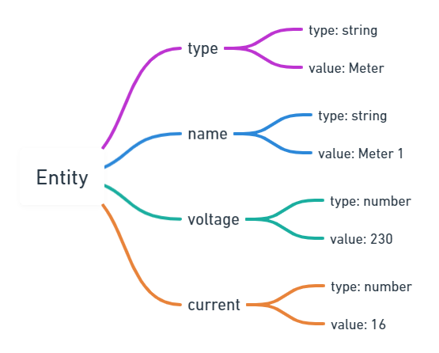
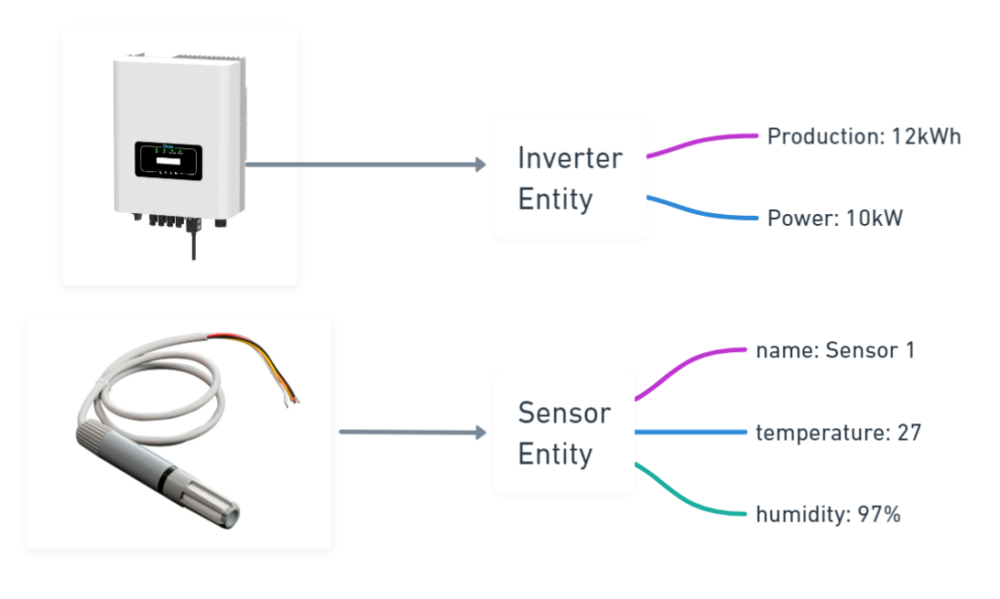
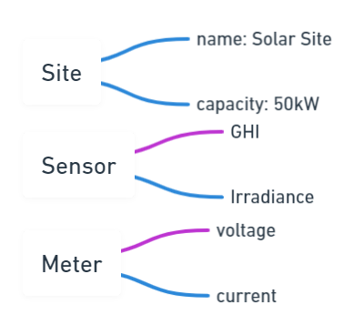
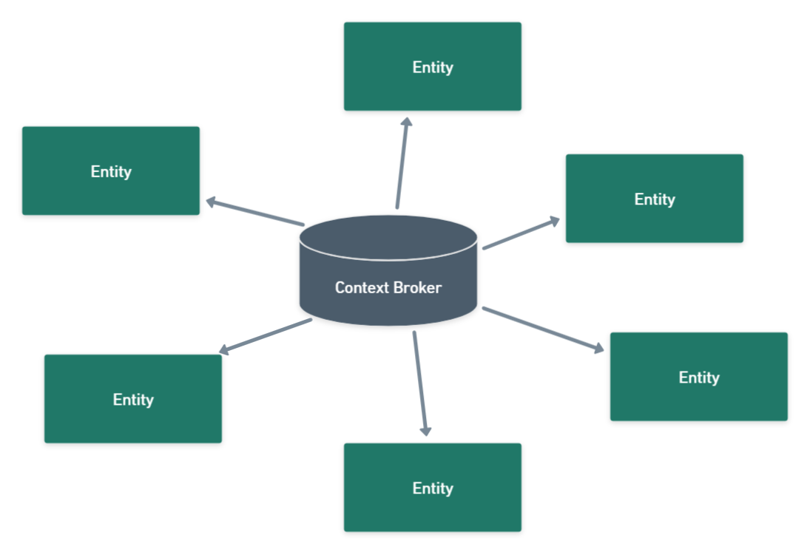
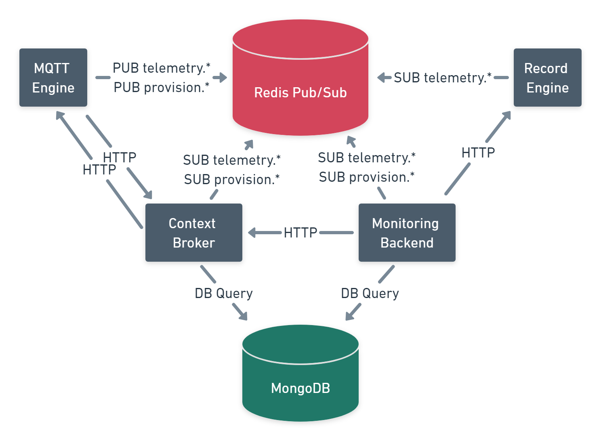
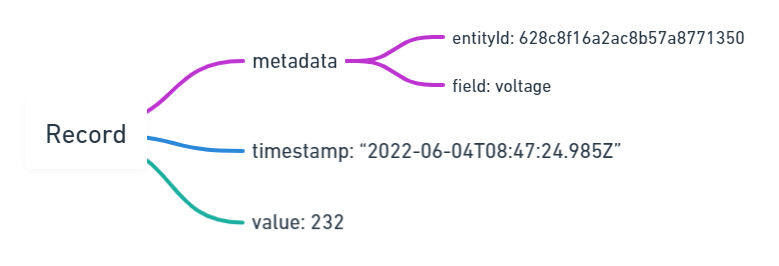
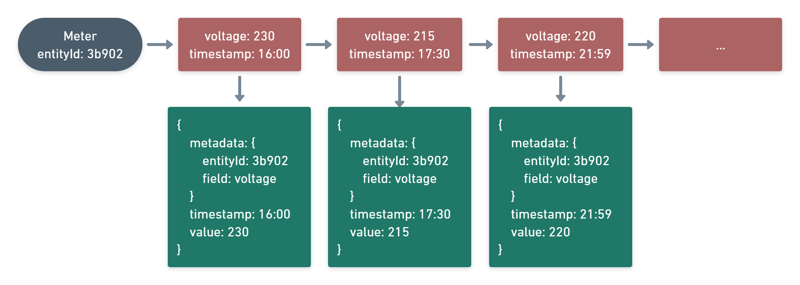
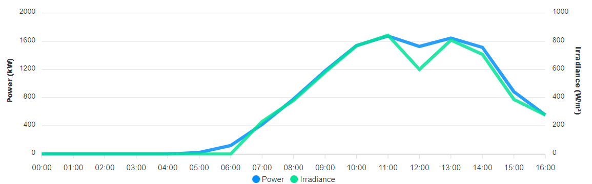
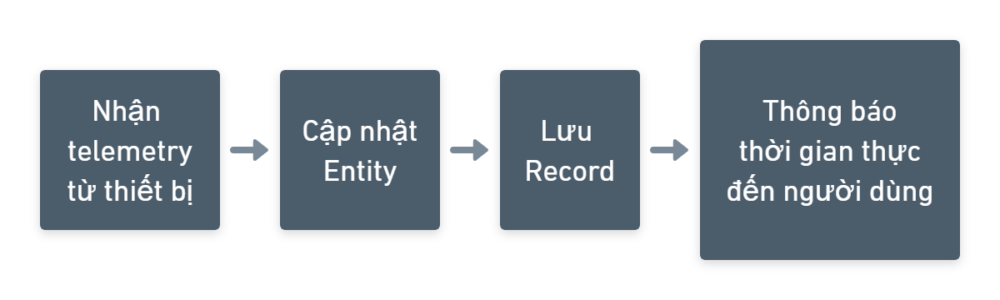

# Architecture

`context-broker` listens on port `8000`.

`record-engine` listens on port `8001`.

`mqtt-agent` listens on port `8004`.

`monitoring-backend` listens on port `8002`.

Overview 1

In our system, every device/reallife entity is called Entity

Entity will model the "real thing" into digital version of it.

The main component that manage Entities is context-broker

Beside context-broker, there are more.

They are microservices.

`record-engine` help manage Records

Records are used to draw figures.

So, overral, things work like this:

