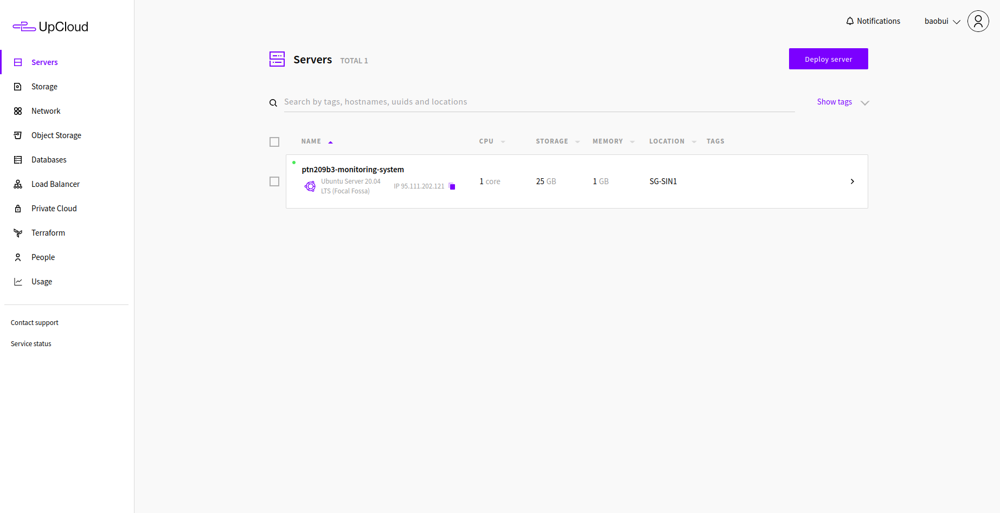
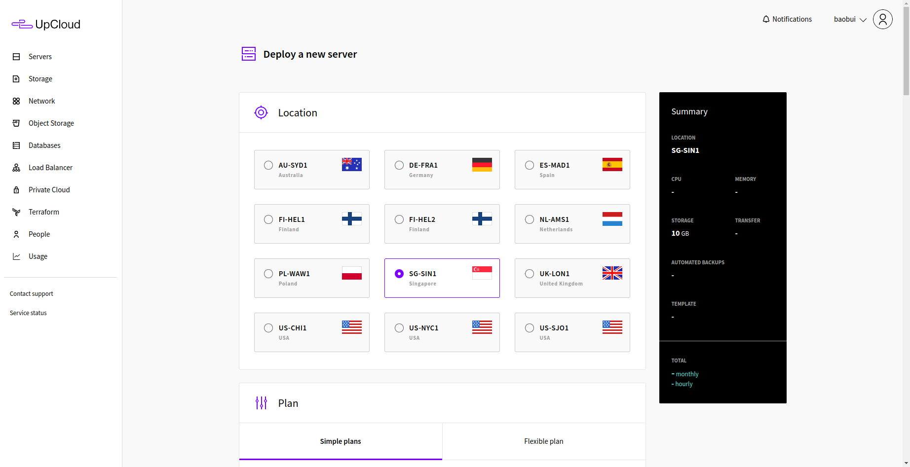
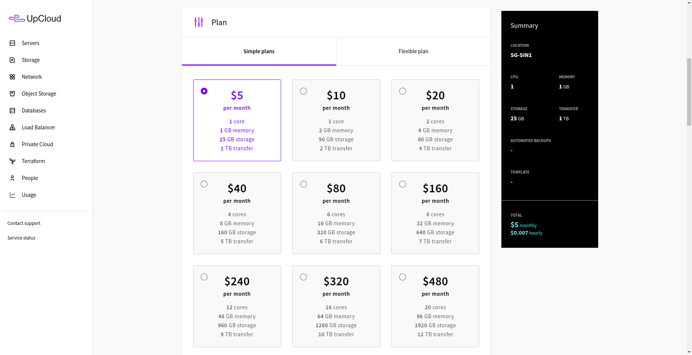
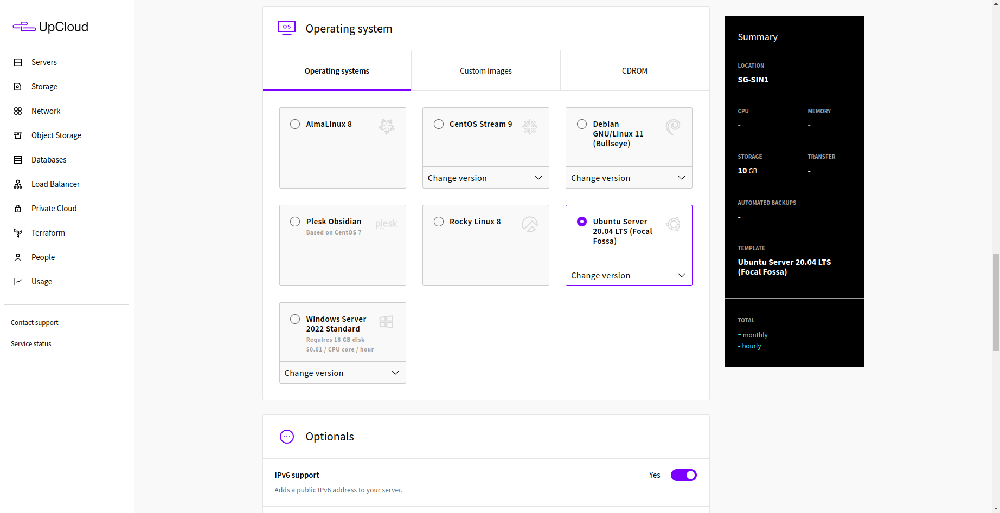
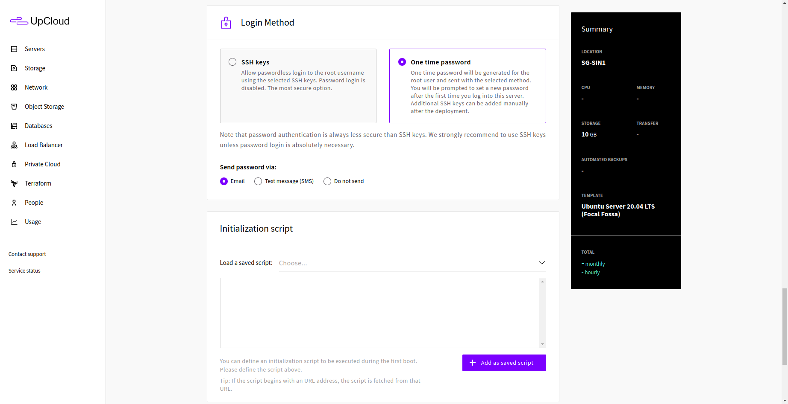
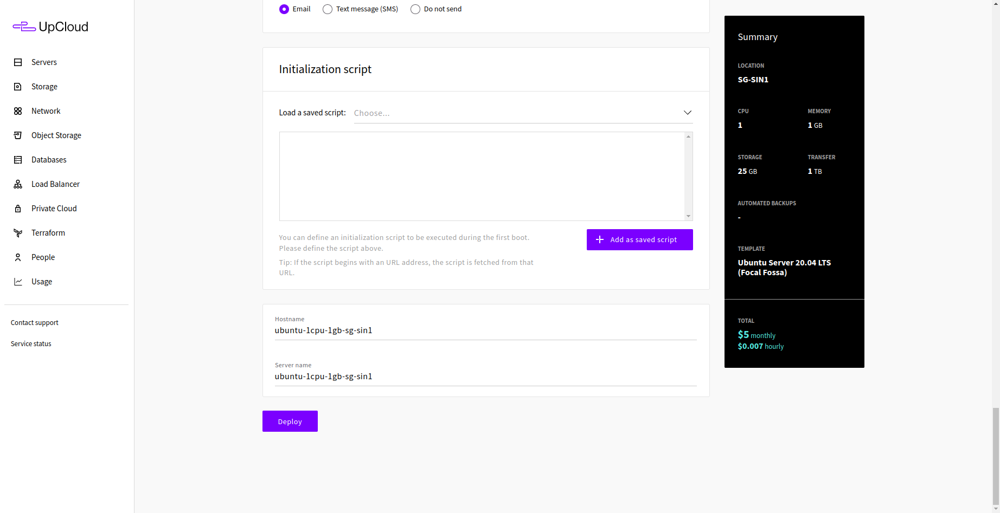
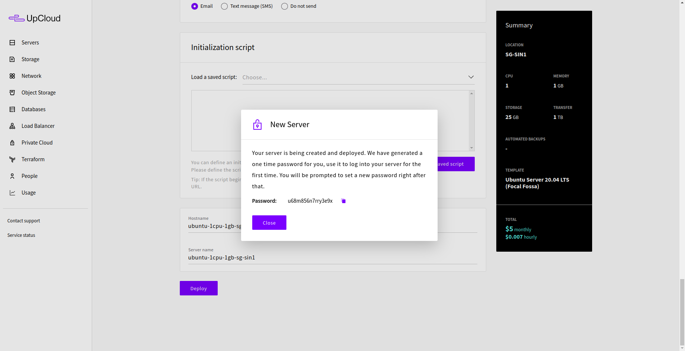
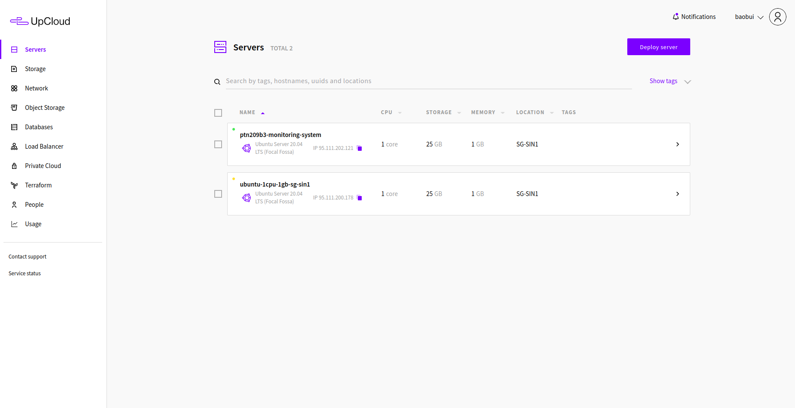
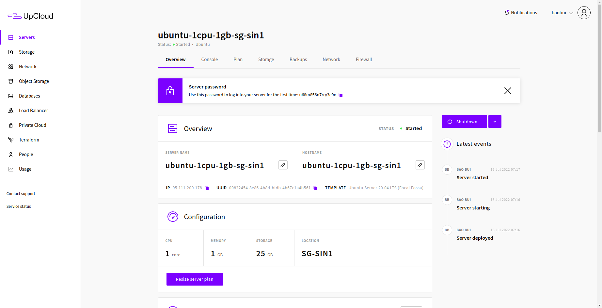

# Deploy server

This guide will instruct you how to deploy a server on UpCloud

Firstly, go to [UpCloud](https://hub.upcloud.com/login), use provided credential to login.

The [homepage](https://hub.upcloud.com/) of Uploud will be shown as below. Click **Deploy server**.

In **Location** section, choose **SG-SIN1** as

In **Plan** section, while at **Simple plans** tab, choose **$5**.

Skip the **Storage** section.

Skip the **Automated backups** section.

In **Operating system** section, while at **Operating systems** tab, choose **Ubuntu Server 20.04 LTS (Focal Fossa)**.

Skip the **Optionals** section.

In **Login Method**, choose **One time password**.

Skip the **Initialization script** section.

Review the summary at the right banner. If every things are OK. Click **Deploy**.

The deployment will take a few seconds to finish, then a dialog will show up. Copy the password and save somewhere. Then click **Close**.

Now the newly deployed server will show up at the homepage, click on it to see details.

Actions related to server deployment will be showed here.

From now, you can start connect to newly deployed server using SSH, and prepare it with prerequisites as in another guide.
