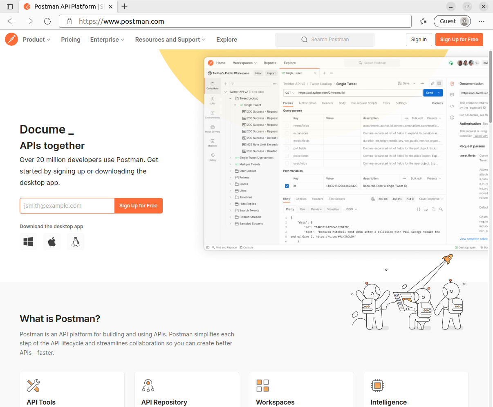
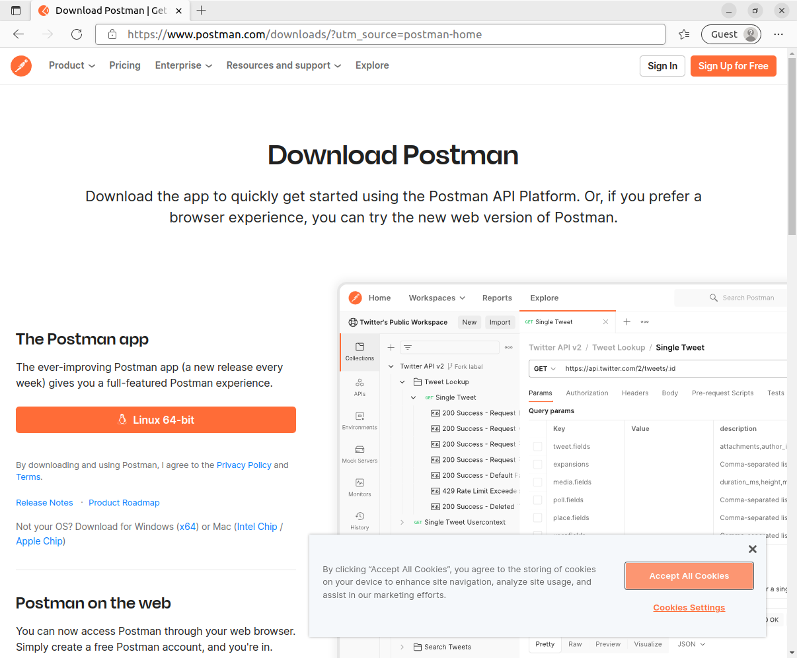
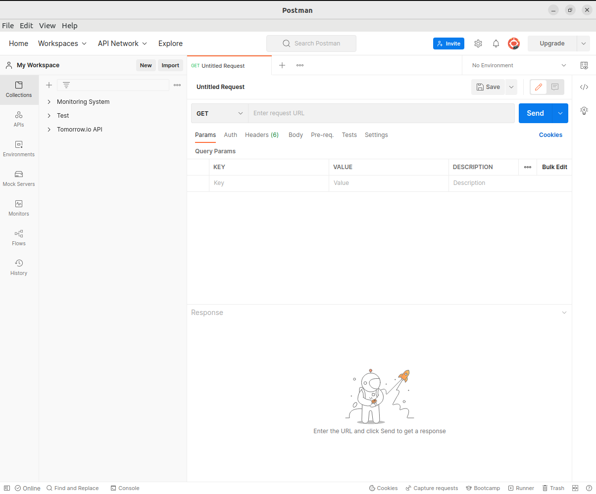

# Using postman

Postman is a great tool for testing REST API.

Postman has many ways to install it onto your PC: Install through snap or directly download from postman website.

The snap package is quite slow to starup. So we will use binary package.

After downloading (the file name usually is `postman-9.24.2-linux-x64.tar.gz`), you can double click or run it from terminal as windows softwares. No install required.

You should use login feature because it will back up your data after login to other computer.

Here you can try many type of request, follow the API defined.
